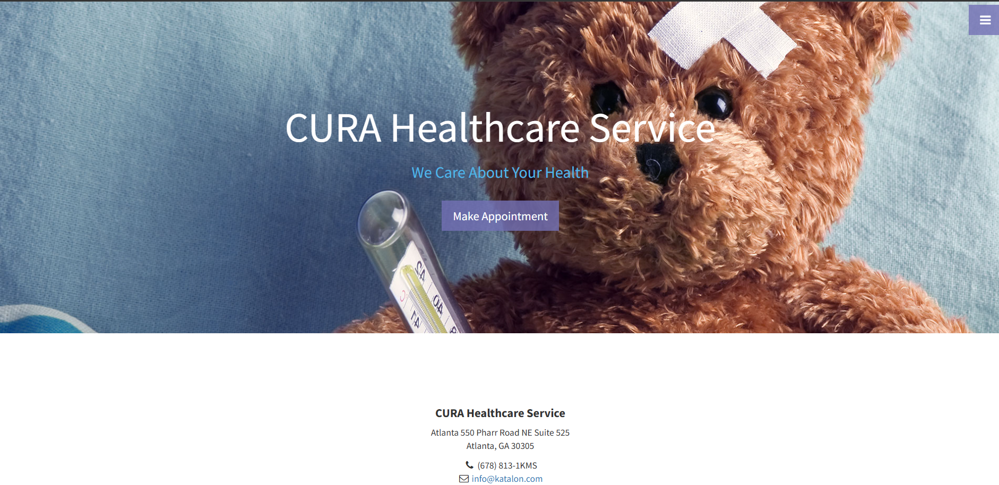
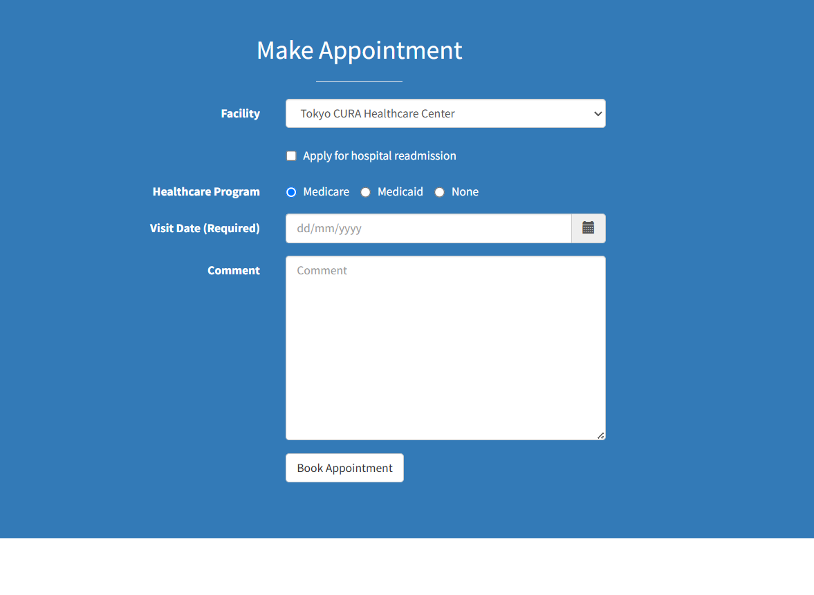
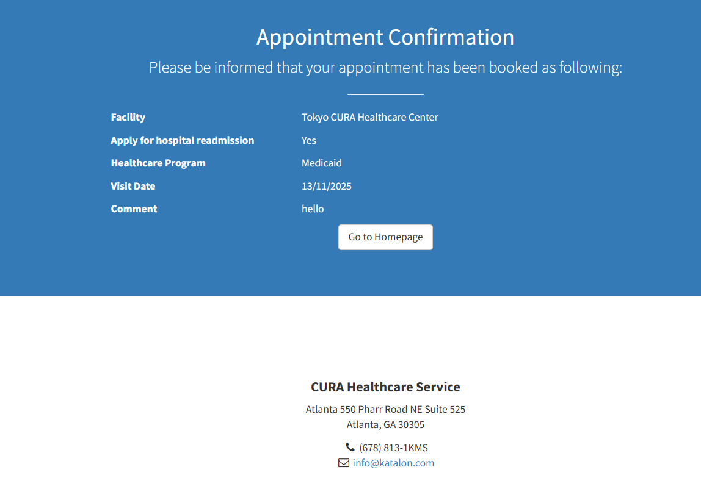
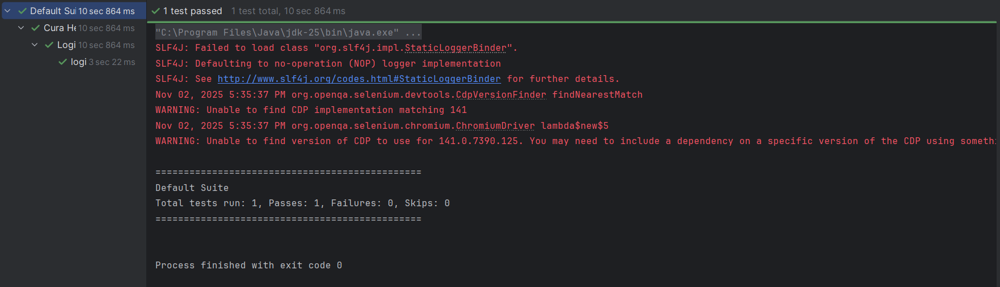

  # CURA Healthcare Service Automation Testing using Selenium and TestNG (Small Basic Project)

 ## Introduction 
 The CURA Healthcare Service Automation Project automates the process of booking an appointment on the CURA Healthcare website. It checks if all steps — from logging in to confirming the appointment — work correctly.

 ##  Tools and Technologies:
 Language: Java

Automation Framework: Selenium WebDriver

Testing Framework: TestNG

Design Pattern: Page Object Model (POM)

Build Tool: Maven

IDE: IntelliJ IDEA

Browser: Chrome

## Objectives
To validate and ensure that the CURA Healthcare system performs accurately by automating functional test cases — reducing manual effort, improving accuracy, and enabling faster regression testing.

## Test is performed in these UI:

1.Frontpage

2. Make Appointment Page

3. confirmation page

## Output

 

